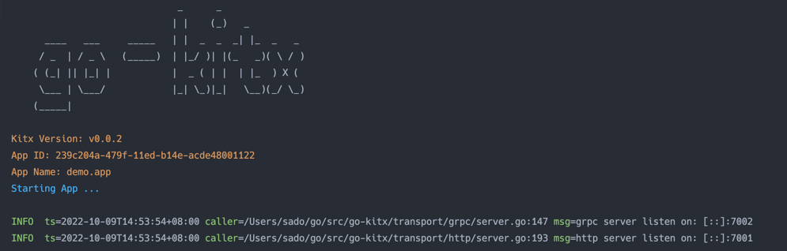

# go-kitx


Some practical tools、 algorithms written in Go


- [x] [**p2c grpc balancer**](https://github.com/sado0823/go-kitx/tree/master/grpc/balancer/p2c)
```go
// example
func test() {
    cc, err := grpc.Dial(r.Scheme()+":///test.server",
        grpc.WithDefaultServiceConfig(fmt.Sprintf(`{"loadBalancingConfig": [{"%s":{}}]}`, p2c.Name)))
    if err != nil {
        t.Fatalf("failed to dial: %v", err)
    }
    defer cc.Close()
}
```

- [x] [**ast rule engine**](https://github.com/sado0823/go-kitx/tree/master/kit/rule)

__supported operator__

* **comparator**: `>` `>=` `<` `<=` `==`

* **bitwise**: `&` `|` `^`

* **bitwiseShift**: `<<` `>>`

* **additive**: `+` `-`

* **multiplicative**: `*` `/` `%`

* **prefix**: `!`(NOT)  `-`(NEGATE)

* **logic**: `&&` `||`

* **func call**: `(` `)` `,` `func`(do func call with build in function and custom function)

* **params type**: `Ident` `Number` `String` `Bool` `array`, `struct` (DO Not support `func` )

* **recursive params call with `.`**: `map.mapKey.mapKey.arrayIndex.structFiledName` (foo.bar.2.Name)

* Link
  * [See Example Here](https://github.com/sado0823/go-kitx/blob/master/kit/rule/example_test.go)
  * [See Unit Test Here](https://github.com/sado0823/go-kitx/blob/master/kit/rule/rule_params_test.go)

```go
// example
import (
    . "github.com/sado0823/go-kitx/kit/rule"
)

func main(){

    expr := `foo + 1 > bar`
	
    param := map[string]interface{}{
        "foo": 5,
        "bar": 6,
    }
	
    res, err := Do(context.Background(), expr, param)
    if err != nil {
        panic(err)
    }
}

```


- [x] [**start app with http and grpc**](https://github.com/sado0823/go-kitx/tree/master)



```go
import (
    "context"
    "sync"
    "testing"
    "time"
	
    "github.com/sado0823/go-kitx/transport/grpc"
    "github.com/sado0823/go-kitx/transport/http"
)

func Test_NewApp(t *testing.T) {

	var wg sync.WaitGroup

	wg.Add(1)
	go func() {
		hs := http.NewServer(http.WithServerAddress("0.0.0.0:7001"))
		gs := grpc.NewServer(grpc.WithServerAddress("0.0.0.0:7002"))

		app := New(
			WithName("demo.app"),
			WithVersion("v0.0.00001"),
			WithMetadata(map[string]string{}),
			WithServer(hs, gs),
		)

		wg.Done()
		err := app.Run()
		if err != nil {
			t.Log(err)
			return
		}
	}()
	wg.Wait()
	time.Sleep(time.Second)

	client, err := grpc.DialInsecure(context.Background(),
		//grpc.WithClientEndpoint("direct:///0.0.0.0:7002,0.0.0.0:7001"),
		//grpc.WithClientEndpoint("discovery:///foo"),
		grpc.WithClientEndpoint("0.0.0.0:7002"),
	)
	if err != nil {
		t.Fatal(err)
	}
	t.Log(client.Target())

	err = client.Invoke(context.Background(), "/abc", 1, map[string]interface{}{})
	t.Log(err)
}
```