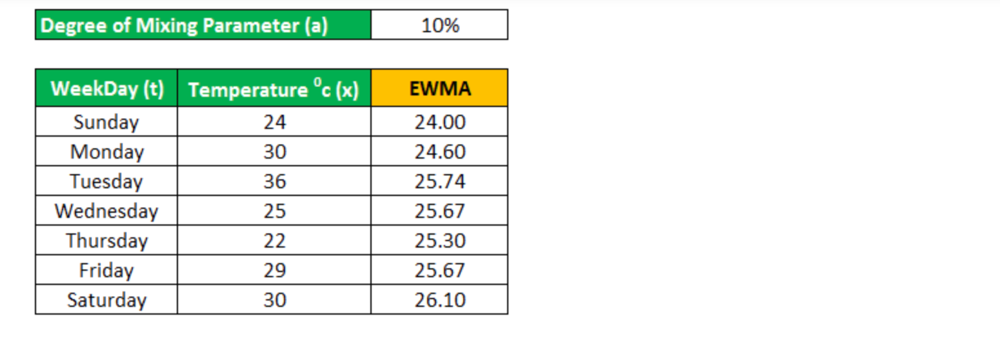
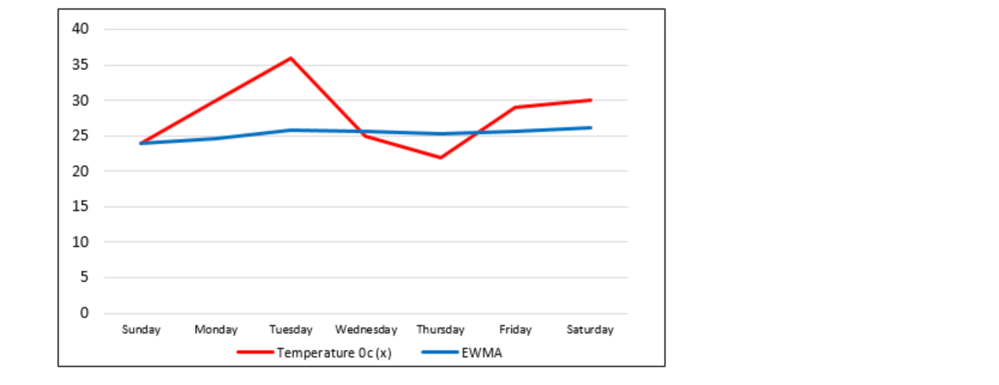
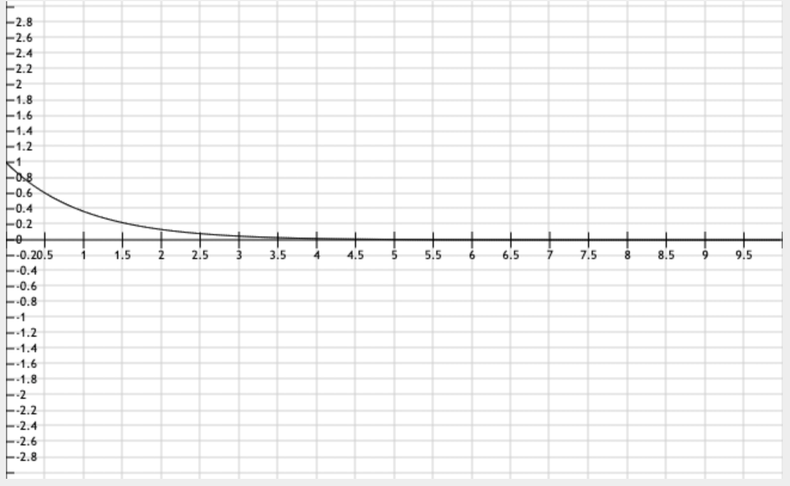
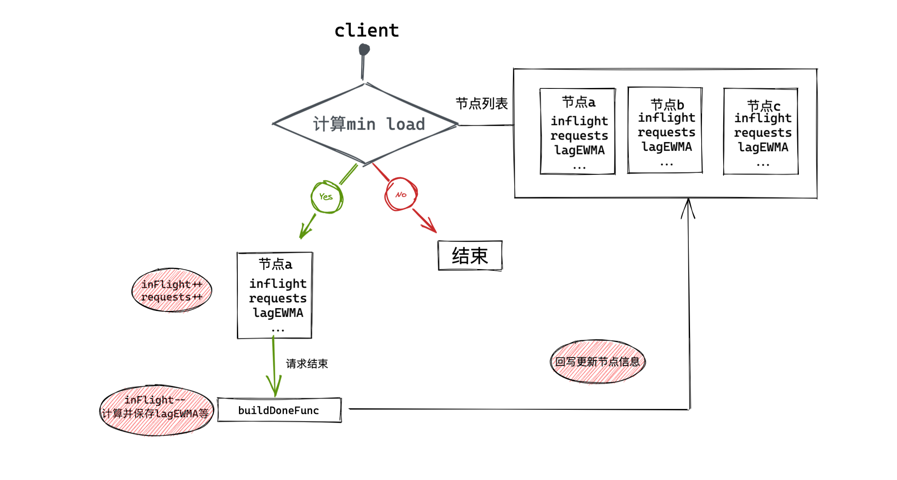

# grpc p2c balancer


​		最近上海疫情, 居家办公了快一个月了, 除了最开始两周早睡早起, 早上还起来跳跳绳运动运动, 后面基本上动一天停一天... 懒惰了不少, 除了看了一本书之外, 文章一篇没发, 之前计划一直想写的go ast规则引擎库也一直没动工, 果然坚持才是最困难的事儿, 下两周工作上又会是比较忙的两周, 今天先来聊下负载均衡里面的p2c算法, 希望上海疫情能够早日结束.


# 项目地址:

https://github.com/sado0823/go-kitx/blob/master/grpc/balancer/p2c/p2c.go


# what?

`P2C`算法全称`pick of 2 choices`，相比`WRR(加权轮询算法)`，P2C随机选择两个节点后在这俩节点里选择优胜者，并通过`指数加权移动平均算法`统计服务端的实时状态，从而做出最优选择。

- `p2c (Pick Of 2 Choices)` 二选一: 在多个节点中随机选择两个节点。

选择两个符合健康度的节点进行计算负载, 优先选择出符合标准的节点, 这里计算负载有运用`cpu`的方式和`计算延迟(lag)+节点拥塞度(inflight)`的方式


- `EWMA (Exponentially Weighted Moving-Average)` 指数加权平均算法公式: `vt = vt-1 * β + vt * (1 - β)`

这个算法之前我们在自适应限流`bbr`算法中也有用到, 主要用于计算cpu负载, 优势为能够减小尖刺(网络波动)的影响

`vt`:当前值

`vt-1`: 上一周期值

`β`:常量


- 牛顿冷却定律衰减模型: `β = 1/e^(k*△t)`

运用这个模型就要用于计算EWMA中的`β`值


# why?

一般的使用场景是:

* 负载均衡算法尽量选择`负载最低`的节点
* 负载均衡算法尽量选择`延迟最低`的节点
* 隔离故障节点, 自动摘流
* 故障节点恢复后自动, 自动接流
* 判断是否存在某行数据,用以减少对磁盘访问，提高服务的访问性能


# how?

## 基本思想

#### EWMA

EWMA主要用于与一般的`算数平均数`作对比, 计算公式为`vt = vt-1 * β + vt * (1 - β)`

我们用一周的`温度`计算来做比较, ewma中β值一般在于(0-1)之间, 这里选取10% = 0.1



一周的趋势图如下




从上图可以看出, 使用ewma能够使得曲线非常的平滑, 从而减缓一些尖刺行为, `β越大越接近平均值`, `β越小越接近原值`.

有一个一般用的计算`β`公式为: `2/(n+1)`


#### 牛顿冷却定律衰减模型

公式: `β = 1/e^(k*△t)`, `e`是数学常数, `△t`为第t次的请求延迟, `k`表示衰减系数 (代码中实现为10s)



设 `x = k * △t`, 则公式为`f(x) = 1/e^x`, `x越大, y越小`, 也就是说

- `△t`延迟越高, `β`越小, ewma中`β`越小, 则越接近原值, 延迟高的情况下凸显出原始延迟, 能够检测到网络毛刺
- `△t`延迟越低, `β`越大, ewma中`β`越大, 则越接近平均值


## 基本流程




## 源码分析

#### roundrobin

先看`google grpc roundrobin`内部实现 `https://github.com/grpc/grpc-go/blob/master/balancer/roundrobin/roundrobin.go`

```go
package roundrobin

import (
	"sync"

	"google.golang.org/grpc/balancer"
	"google.golang.org/grpc/balancer/base"
	"google.golang.org/grpc/grpclog"
	"google.golang.org/grpc/internal/grpcrand"
)

// Name is the name of round_robin balancer.
const Name = "round_robin"

var logger = grpclog.Component("roundrobin")

// newBuilder creates a new roundrobin balancer builder.
func newBuilder() balancer.Builder {
	return base.NewBalancerBuilder(Name, &rrPickerBuilder{}, base.Config{HealthCheck: true})
}

func init() {
	balancer.Register(newBuilder())
}

type rrPickerBuilder struct{}

func (*rrPickerBuilder) Build(info base.PickerBuildInfo) balancer.Picker {
	...
}

type rrPicker struct {
}

func (p *rrPicker) Pick(balancer.PickInfo) (balancer.PickResult, error) {
	...
}
```

以上代码省去了关键实现, 可以看出, 要实现一个负载均衡算法, 只要需要实现内部的两个`interface`

```go
// 1. 有节点更新会调用build方法
type PickerBuilder interface {
	Build(info PickerBuildInfo) balancer.Picker
}
```

```go
// 2. 挑选节点
type Picker interface {
	Pick(info PickInfo) (PickResult, error)
}
```

```go
// 3. 注册负载均衡器
func init() {
	balancer.Register(newBuilder())
}
```


#### p2c

`https://github.com/sado0823/go-kitx/blob/master/grpc/balancer/p2c/p2c.go`


##### 接口

```go
// 实现 PickerBuilder 接口
type p2cPickBuilder struct {
}
```


```go
// 实现 Picker 接口
type p2cPicker struct {
	conns []*subConn
	r     *rand.Rand
	stamp *atomicx.AtomicDuration
	lock  sync.Mutex
}
```


##### 核心数据结构

```go
type p2cSubConn struct {
	addr resolver.Address
	conn balancer.SubConn

	lagEWMA uint64	// 请求耗时, 计算后的ewma

	inFlight int64	// 节点拥塞度, 正在处理的请求
	successEWMA  uint64	// 请求成功数量
	requests int64	// 请求量

	lastLag int64	// 上一次请求耗时, 用于计算ewma
	pickTime int64	// 上一次选择的时间时间戳
}
```

在此基础上, 还可以再加上`weight`字段, 设置权重


##### load负载计算

有两种方式:

- `load = lagEWMA * inFlight`: `lagEWMA` 相当于平均请求耗时，`inFlight` 是当前节点正在处理请求的数量，相乘大致计算出了当前节点的网络负载, 我们采用的就是这种方式
- `oad = cpuEWMA * lag * inFlight`:  `cpuEWMA` 利用服务端的cpu值计算负载, 可以从`balancer.DoneInfo. Trailer`中从服务端传递, 实际为`metadata.MD`类型, `map[string][]string`的别名

```go
// load = lagEWMA * inFlight
func (s *p2cSubConn) load() int64 {
	lag := int64(math.Sqrt(float64(atomic.LoadUint64(&s.lagEWMA) + 1)))
	load := lag * (atomic.LoadInt64(&s.inFlight) + 1)
	if load == 0 {
		// penalty是初始化没有数据时的惩罚值, 在没有被选过的情况下, 会强制选择一次
		return penalty
	}

	return load
}
```


##### Pick过程

```go
	var chosen *p2cSubConn
	switch len(p.conns) {
	case 0:	// 没有节点, 直接报错
		return balancer.PickResult{}, balancer.ErrNoSubConnAvailable
	case 1:	// 一个节点, 直接返回
		chosen = p.choose(p.conns[0], nil)
	case 2: // 两个节点, 返回负载最低的节点
		chosen = p.choose(p.conns[0], p.conns[1])
	default: // 多个节点, 最多经常三次计算, 选择合适的节点
		var node1, node2 *p2cSubConn
		// 三次随机选择节点
		for i := 0; i < pickTimes; i++ {
			a := p.r.Intn(len(p.conns))
			b := p.r.Intn(len(p.conns) - 1)
			if b >= a {
				// 防止出现相同节点
				b++
			}
			node1 = p.conns[a]
			node2 = p.conns[b]

			// 选出一次符合要求的节点则停止
			if node1.healthy() && node2.healthy() {
				break
			}
		}

		chosen = p.choose(node1, node2)
	}
```


##### 请求结束, 更新节点信息

```go
		// 正在处理的请求数-1
		atomic.AddInt64(&c.inFlight, -1)

		// 计算相对时间
		now := time.Since(initTime)
		last := atomic.SwapInt64(&c.lastLag, int64(now))
		td := int64(now) - last
		if td < 0 {
			td = 0
		}

		// 牛顿冷却定律的衰减模型, 确定ewma中的β值, β = 1/e^(k*△t)
		beta := math.Exp(float64(-td) / float64(decayTime))
		lag := int64(now) - start
		if lag < 0 {
			lag = 0
		}
		olag := atomic.LoadUint64(&c.lagEWMA)
		if olag == 0 {
			beta = 0
		}

		// 指数加权平均算法 vt = vt-1 * β + vt * (1 - β)
		// 存储当前lagEWMA
		atomic.StoreUint64(&c.lagEWMA, uint64(float64(olag)*beta+float64(lag)*(1-beta)))

		success := initSuccess
		if info.Err != nil {
			switch status.Code(info.Err) {
			case codes.DeadlineExceeded, codes.Internal, codes.Unavailable, codes.DataLoss:
				success = 0
			}
		}

		oldSuccess := atomic.LoadUint64(&c.successEWMA)
		// 指数加权平均算法 vt = vt-1 * β + vt * (1 - β)
		// 存储当前successEWMA
		atomic.StoreUint64(&c.successEWMA, uint64(float64(oldSuccess)*beta+float64(success)*(1-beta)))
```


# example

```go
func test() {
	cc, err := grpc.Dial(r.Scheme()+":///test.server",
		grpc.WithDefaultServiceConfig(fmt.Sprintf(`{"loadBalancingConfig": [{"%s":{}}]}`, p2c.Name)))
	if err != nil {
		t.Fatalf("failed to dial: %v", err)
	}
	defer cc.Close()
}

```


# references

- [负载均衡p2c算法](https://mp.weixin.qq.com/s/J8s-nqJnvL_knRD1XjOpNA)
- [Exponentially Weighted Moving Average (EWMA)](https://corporatefinanceinstitute.com/resources/knowledge/trading-investing/exponentially-weighted-moving-average-ewma/)
- [Definition of EWMA](https://www.wallstreetmojo.com/ewma/)
- [指数加权平均算法](https://www.jianshu.com/p/6d16f9a4351c)
- [牛顿冷却定律的时间衰减函数模型](https://blog.51cto.com/u_9269309/1865554)
- [牛顿冷却定律](http://www.ruanyifeng.com/blog/2012/03/ranking_algorithm_newton_s_law_of_cooling.html)
- [负载均衡p2c算法数据](https://exceting.github.io/2020/08/13/%E8%B4%9F%E8%BD%BD%E5%9D%87%E8%A1%A1-P2C%E7%AE%97%E6%B3%95/) 
- [grpc轮询算法](https://github.com/grpc/grpc-go/blob/master/balancer/roundrobin/roundrobin.go)
