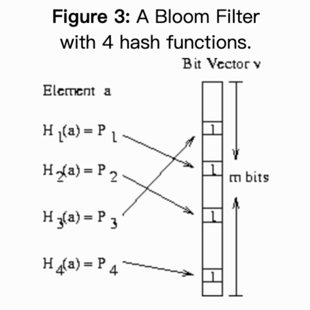

# go-bloom
a go bloom filter , base on different implement like redis ...


# 项目地址:

https://github.com/sado0823/go-kitx


# what?

```js
上一篇在提到缓存击穿的时候, 有一种解决办法就是布隆过滤器


布隆过滤器（英語：Bloom Filter）是1970年由布隆提出的。 它实际上是一个很长的二进制向量和一系列随机映射函数。 布隆过滤器可以用于检索一个元素是否在一个集合中。 它的优点是空间效率和查询时间都远远超过一般的算法，缺点是有一定的误识别率和删除困难

```


# why?

```js
布隆过滤器:  可以判断某元素在不在集合里面,因为存在一定的误判和删除复杂问题
```

一般的使用场景是:

* 防止缓存击穿(防止恶意攻击)
* 垃圾邮箱过滤
* cache digests (缓存索引)
* 模型检测器
* 判断是否存在某行数据,用以减少对磁盘访问，提高服务的访问性能


# how?

## 基本思想

通过多个`hash`方法, 进行多次hash操作, 使其值位于`bit`不同位上, 检测该`bit`上的数据是否为`1`, 从而判断是否存在




## 源码分析

`interface: bloom.go`

```go
// 过滤器的核心实现, 通过interface的方式, 可以支持多种实现
// 目前实现了基于redis bit数据类型的过滤器
Provider interface {
		Add(data []byte) error
		Exists(data []byte) (bool, error)
}

// Filter is a bloom filter
Filter struct {

		// todo counter
		total int64
		hit   int64
		miss  int64

		provider Provider
}
```


`redis实现: internal/redis/redis_bit.go`

```js
// 实现Provider接口的两个方法

// Add implement Provider interface
func (r *Provider) Add(data []byte) error {
	location := r.getBitLocation(data)
	return r.set(location)
}

// Exists implement Provider interface
func (r *Provider) Exists(data []byte) (bool, error) {
	location := r.getBitLocation(data)
	return r.check(location)
}

// 核心方法
// 通过14次hash, 每次hash都在数据最后追加一个byte(index), 最后进行取模, 分布在map里面的每个区间
// 检查是否存在时, 对每个bit位进行判断, 如果有一个等于0, 则数据不存在
// getBitLocation return data hash to bit location
func (r *Provider) getBitLocation(data []byte) []uint {
	l := make([]uint, maps)
	for i := 0; i < maps; i++ {
		hashV := r.hash(append(data, byte(i)))
		l[i] = uint(hashV % uint64(maps))
	}
	return l
}
```


`todo`

```js
1) 可以实现统计数据, 比如总量, 命中率, 丢失率等

2) 实现其它bloom过滤器provider(目前只有基于redis bit)
```


# example

```go
func test() {
	filter := NewRedis("127.0.0.1:6379", "test-bloom", 1024)

	_ = filter.Add([]byte("a"))
	_ = filter.Add([]byte("b))

	_, _ = filter.Exists([]byte("a))
	_, _ = filter.Exists([]byte("p))
}

```


# references

1.https://github.com/tal-tech/go-zero

2.http://pages.cs.wisc.edu/~cao/papers/summary-cache/node8.html
